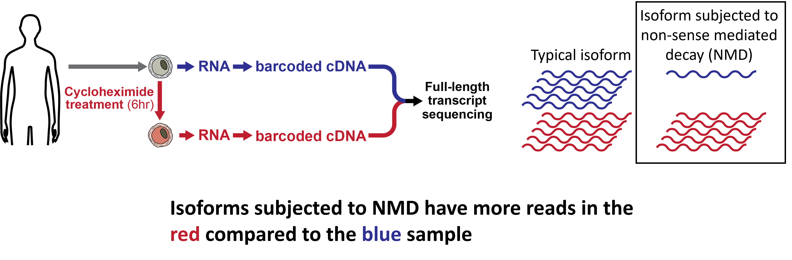
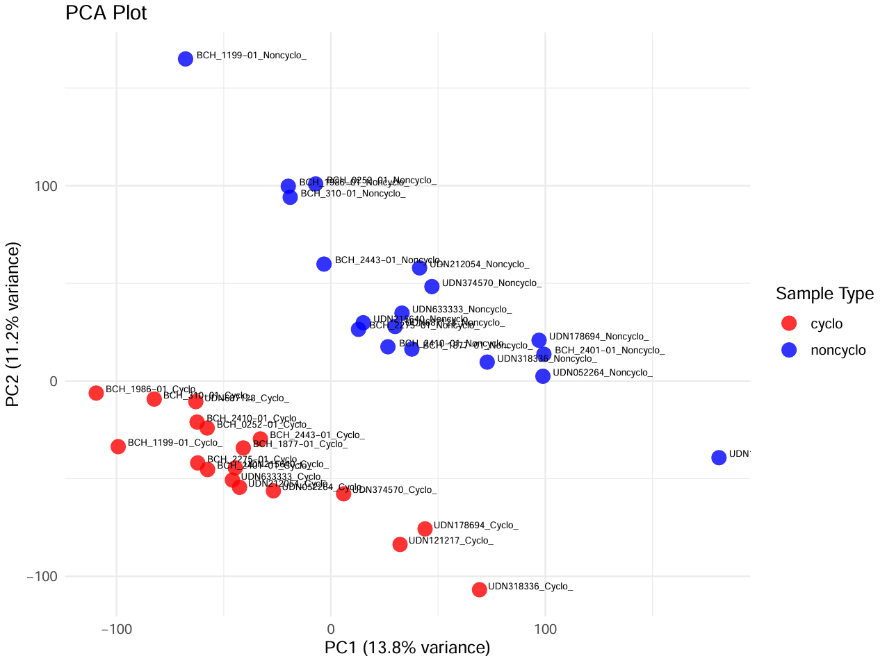

```{r setup, include=FALSE}
knitr::opts_chunk$set(echo = TRUE)

library(kableExtra)

# Load tables
markdown_tables <- readRDS("Cyclo_noncyclo_comparison/Examples/example1/5.Plotting/markdown_tables.rds")
```

## Usage

Please view the Complete_workflow_example2.sh file in the example2 folder to see a step-by-step usage of this package with dummy data.

## Introduction

This package takes in data from bulk-Isoseq processed with and without cycloheximide (CHX), a nonsense mediated decay inhibitor (NMDi), and identifies isoforms and genes that are differentially expressed and/or undergoing NMD.

Prior to using this package, the following data processing needs to be performed on bulk [Isoseq](https://isoseq.how/) data:
<div style="text-align: center;">
```{r, echo=FALSE, out.width='70%', out.height='300px'}
# Include graphic explaining experimental paradigm here.

```
</div>

The package outputs these following results based on hypothesis testing with chi-square tests within samples and between samples:

### Isoforms

- **Hypothesis 1**: isoforms expressed higher with CHX compared to non-CHX
- **Hypothesis 2**: differentially expressed isoforms
- **Hypothesis 3**: differentially expressed isoforms with CHX

### Genes

- **Hypothesis 1**: genes expressed higher with CHX compared to non-CHX
- **Hypothesis 2**: differentially expressed genes
- **Hypothesis 3**: differentially expressed genes with CHX
- **Hypothesis 5**: genes with novel isoforms

Please note that hypothesis 4 is deprecated and is purposely skipped. 

## Hypothesis 1: Isoforms/Genes expressed higher with CHX compared to non-CHX

If we have an isoform/gene, and the isoform/gene contains a splicing variant that causes NMD, we should see that the isoform/gene has fewer mRNA transcripts because they should be degraded by NMD. If we add an NMDi like CHX, we stabilize the mRNA and we see more reads in the CHX treated sample. 

<div style="text-align: center;">
```{r, echo=FALSE, out.width='50%'}
# Include graphic explaining experimental paradigm here.

```
</div>

Here are specifics regarding the statisical testing using a chi-square 2x2 table:
<div style="text-align: center;">
```{r, echo=FALSE, out.width='50%'}
# Include graphic explaining experimental paradigm here.

```
</div>


For example, isoforms in HARS1 is known to undergo alternative splicing which results in NMD in UDN212054 As a result, treatment with CHX causes HARS1 isoforms to show up as significant under hypothesis 1. However, EDN1 was not previously known to harbor variants that result in NMD in this patient, so EDN1 is now a potential candidate for evaluating the genetic cause.

<div style="text-align: center;">
```{r, echo=FALSE, out.width='70%'}
knitr::include_graphics("Cyclo_noncyclo_comparison/Markdown/Hyp1.png")
```
</div>

<div style="text-align: center;">
```{r, echo=FALSE, out.width='50%'}
 df <- markdown_tables$hyp1
  knitr::kable(df, caption = "UDN212054") %>%
    kable_styling(font_size = 5)  # Adjust the font size as needed
```
</div>


## Hypothesis 2: Differentially expressed isoforms/genes

For hypothesis 2, we are only looking at the reads from the noncyclo samples.

You might be thinking, why are we even looking at noncyclo reads in isolation. Don’t we need the cyclo reads to say anything about NMD? And you’re totally right, we would need the cyclo reads to study NMD. However, NMD isn’t the only way transcripts can be affected by genetic variants. Transcripts can also just have lower expression due to regulatory variants for example. So we wanted a hypothesis that can also allow us to find transcripts that have lower or higher expression due to things other than NMD. Which is why we came up with hypothesis 2, which allows us to find isoforms that have lower/higher expression regardless of NMD.

Here are specifics regarding the statisical testing using a chi-square 2x2 table:
<div style="text-align: center;">
```{r, echo=FALSE, out.width='50%'}
# Include graphic explaining experimental paradigm here.
knitr::include_graphics("Cyclo_noncyclo_comparison/Markdown/Hyp2_stats.png")
```
</div>

For example, VTA1 is known to have decreased expression in UDN687128. Furthermore, the decrease in expression is allele-specific and not related to NMD.

<div style="text-align: center;">
```{r, echo=FALSE, out.width='70%'}

```
</div>

<div style="text-align: center;">
```{r, echo=FALSE, out.width='50%'}
 df <- markdown_tables$hyp2_gene_below
  knitr::kable(df, caption = "UDN687128") %>%
    kable_styling(font_size = 10)  # Adjust the font size as needed
```
</div>

## Hypothesis 3: Differentially expressed isoforms/genes with CHX

Hypothesis 3 is very similar to hypothesis 2, but in hypothesis 3, we are using just the cyclo samples. Hypothesis 3 allows us to pick out isoforms/genes that are differentially expressed when treated with cycloheximide. 

Here are specifics regarding the statisical testing using a chi-square 2x2 table:
<div style="text-align: center;">
```{r, echo=FALSE, out.width='50%'}
# Include graphic explaining experimental paradigm here.
knitr::include_graphics("Cyclo_noncyclo_comparison/Markdown/Hyp3_stats.png")
```
</div>

For example, SET isoforms are known to have splicing variants that result in NMD in UDN215640. UDN215640 also has SET isoforms with splicing variants that do not undergo NMD, as a result, you can notice that there are some isoforms that are highlighted in SET where the cyclo TPM is not greater than the noncyclo TPM. While these isoforms are shown here as being captured by hypothesis 3, they are also captured by hypothesis 2. 

<div style="text-align: center;">
```{r, echo=FALSE, out.width='70%'}
knitr::include_graphics("Cyclo_noncyclo_comparison/Markdown/Hyp3_isoform_above.png")
```
</div>

<div style="text-align: center;">
```{r, echo=FALSE, out.width='50%'}
 df <- markdown_tables$hyp3_isoform_above
  knitr::kable(df, caption = "UDN215640") %>%
    kable_styling(font_size = 10)  # Adjust the font size as needed
```
</div>

## Hypothesis 5: Genes with novel isoforms

Instead of looking at isoforms individually like we did in hypothesis 1, we wanted to have a method of grouping novel isoforms together. This way, we increase the statistical power to determine whether novel isoforms in a gene is undergoing NMD. We make the assumption that isoforms that have low/no abundance in the noncyclo sample are isoforms that are “novel” and likely ones that underwent NMD. We want to group these together into a single bin so that we have more power for statistical testing. 

Here is a diagram illustrating the binning process:
<div style="text-align: center;">
```{r, echo=FALSE, out.width='50%'}
# Include graphic explaining experimental paradigm here.

```
</div>

Here are specifics regarding the statisical testing using a chi-square 2x2 table:
<div style="text-align: center;">
```{r, echo=FALSE, out.width='50%'}
# Include graphic explaining experimental paradigm here.

```
</div>

For example, MFN2 is known to have several isoforms that have alternative splicing and results in NMD. Individually, these novel isoforms have low read counts. However, when combined together at the gene level, we are able to pick out MFN2 as a gene containing novel isoforms that undergo NMD. 

<div style="text-align: center;">
```{r, echo=FALSE, out.width='70%'}

```
</div>

<div style="text-align: center;">
```{r, echo=FALSE, out.width='50%'}
 df <- markdown_tables$hyp5
  knitr::kable(df, caption = "UDN633333") %>%
    kable_styling(font_size = 10)  # Adjust the font size as needed
```
</div>

## Validating effects of NMD

To validate the effects of NMD, PCA was performed on the gene-level and isoform-level expression matrix for the 13 patients (26 samples) included in the analysis. 

### Gene-Level
<div style="text-align: center;" >
```{r, echo=FALSE, out.width='60%'}
# Include graphic explaining experimental paradigm here.

```
</div>

### Isoform-Level
<div style="text-align: center;">
```{r, echo=FALSE, out.width='60%'}
# Include graphic explaining experimental paradigm here.
knitr::include_graphics("Cyclo_noncyclo_comparison/Markdown/PCA_isoform_level.pdf.png")
```
</div>


## Acknowledgements

This package is developed during my time at the University of Washington as a Genome Sciences graduate student in the Stergachis Lab. Acknowledgements to: 

+ Andrew Stergachis 

+ Adriana Sedeno Cortes

+ More to be added soon
