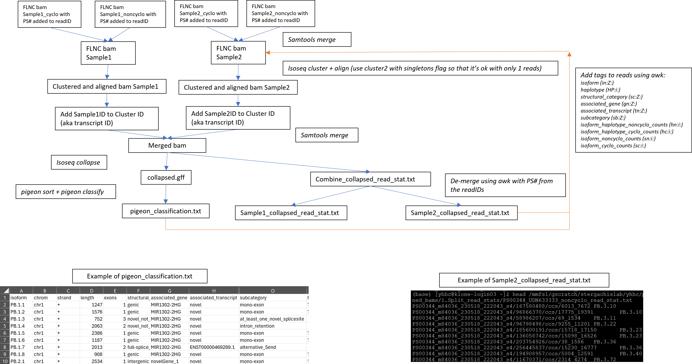
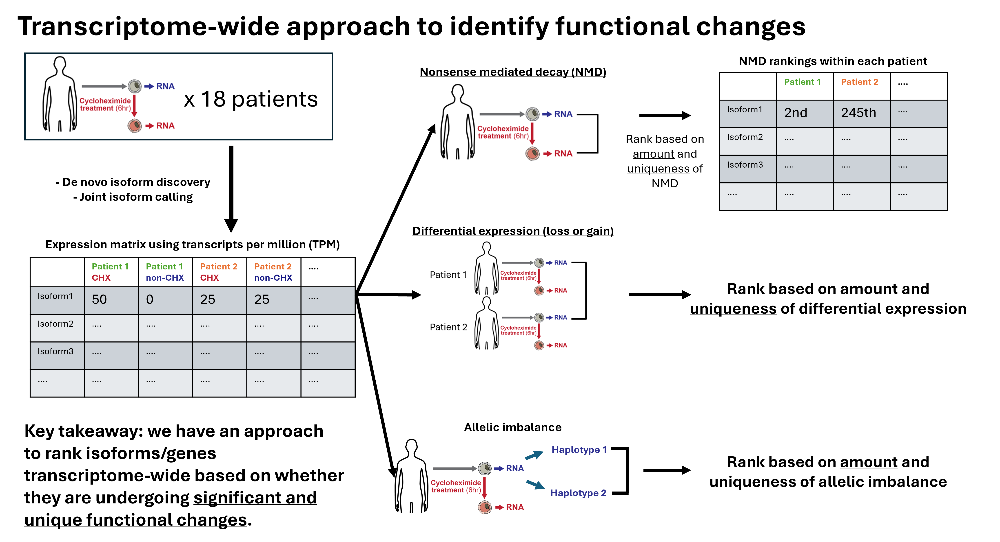
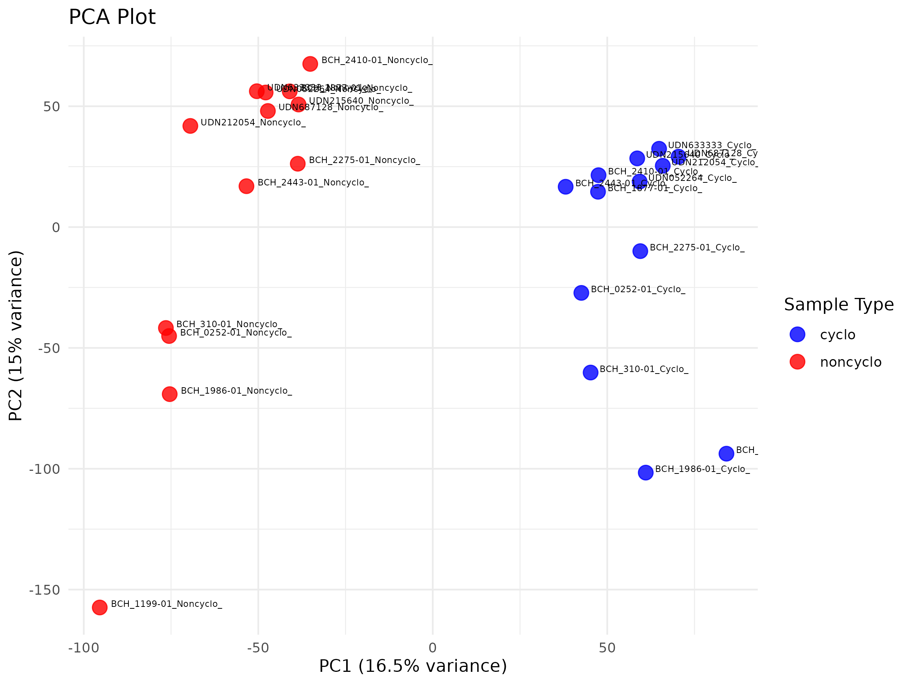
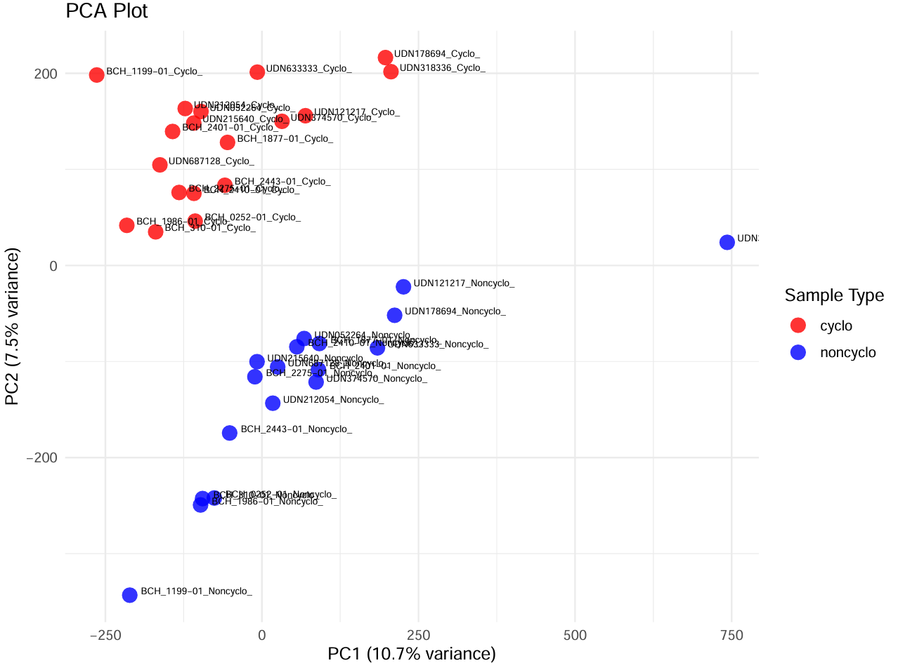

NMDSeqR
================
Hank Cheng
2024-10-30

## Installation and Usage

``` bash
git clone https://github.com/yhhc2/Iso-seq_public.git
```

Detailed usage information will be added soon.

## Introduction

This package takes in data from bulk-Isoseq processed with and without
cycloheximide (CHX), a nonsense mediated decay inhibitor (NMDi), and
identifies isoforms and genes that are differentially expressed and/or
undergoing NMD.

Prior to using this package, the following data processing needs to be
performed on bulk [Isoseq](https://isoseq.how/) data:

<div style="text-align: center; border: 1px solid black; padding: 5px; display: inline-block;">



</div>

 

The package then takes the result from de novo isoform discovery and
joint isoform calling to evaluate each isoform and gene in each
individual to see if it is undergoing significant and unique functional
effects:

- **1. Nonsense mediated decay (NMD)**: isoforms/genes expressed higher
  with CHX compared to non-CHX.
- **2. Expression outlier**: differentially expressed (gain or loss of
  expression) isoforms/genes compared to control individuals.
- **3. Allelic Imbalance**: genes with haplotype-specific gain or loss
  of expression.

<div style="text-align: center; border: 1px solid black; padding: 5px; display: inline-block;">



</div>

## Statistical approach for ranking

Please refer to these slides for specifics on the ranking approach with
examples:

[Statistical approach slides with
examples](https://docs.google.com/presentation/d/1QMtpavZtk7WnvgzzZJHgNS349EH08Kvn/edit?usp=drive_link&ouid=105176465598666354491&rtpof=true&sd=true)

## Validating effects of CHX

To validate the effects of CHX, PCA was performed on the gene-level and
isoform-level expression matrix for the 13 patients (26 samples)
included in the analysis. The clusters are being formed based on CHX
treatment, which supports the idea that sample variability is not enough
to prevent us from pulling out findings that are a result of the CHX
treatment.

### Gene-Level

<div style="text-align: center;">



</div>

### Isoform-Level

<div style="text-align: center;">



</div>

### Shiny App Visualizations

Please visit this site to see an example of how to more interactively
visualize the results:
<http://multiome.brotmanbaty.org/app_direct/multiome-browser/#>

## Acknowledgements

This package is developed during my time at the University of Washington
as a Genome Sciences graduate student in the Stergachis Lab.
Acknowledgements to:

- Andrew Stergachis

- Adriana Sedeno Cortes

- Daniela Witten

- More to be added soon
