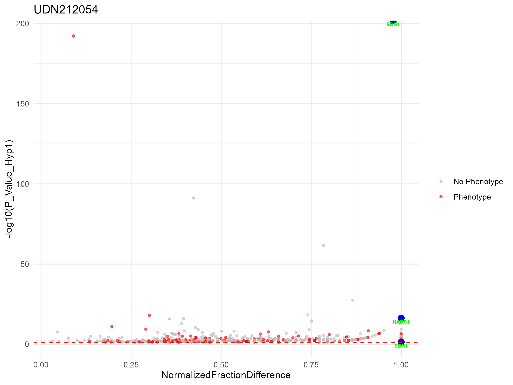
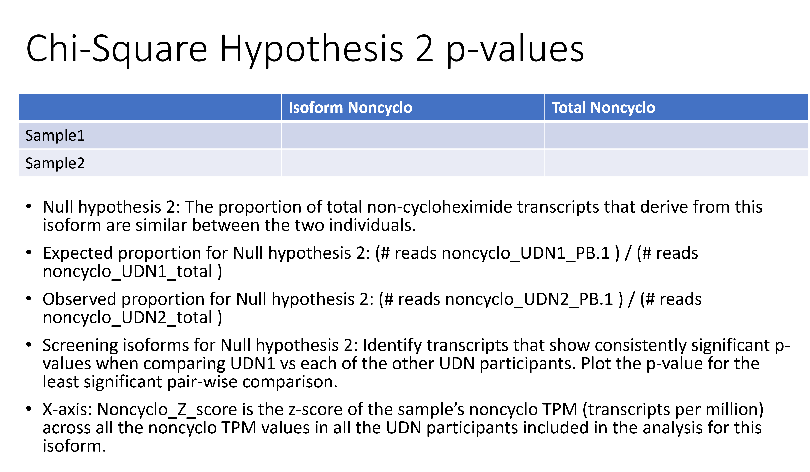
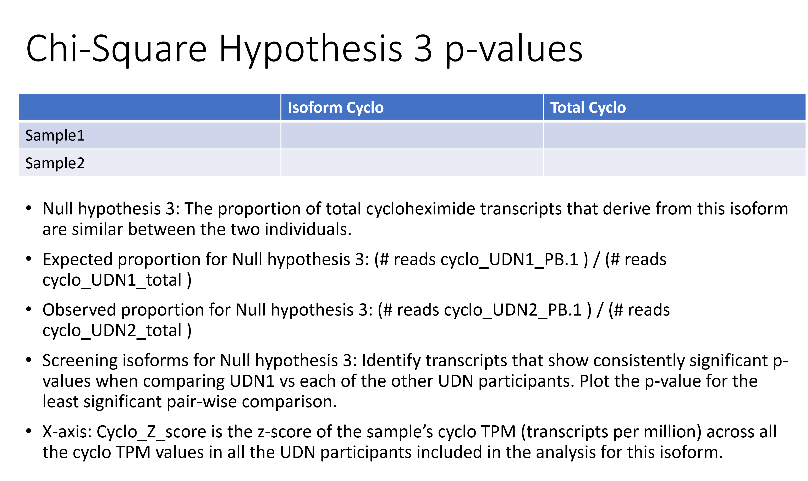

NMDSeqR
================
Hank Cheng
2024-05-23

## Installation

``` bash
git clone https://github.com/yhhc2/Iso-seq_public.git
```

## Usage

Please view the Complete_workflow_example2.sh file in the example2
folder to see a step-by-step usage of this package with simulated dummy
data.

Cyclo_noncyclo_comparison/Examples/example2/Complete_workflow_example2.sh

## License

TBD

## Introduction

This package takes in data from bulk-Isoseq processed with and without
cycloheximide (CHX), a nonsense mediated decay inhibitor (NMDi), and
identifies isoforms and genes that are differentially expressed and/or
undergoing NMD.

Prior to using this package, the following data processing needs to be
performed on bulk [Isoseq](https://isoseq.how/) data:

<div style="text-align: center;">


</div>

The package outputs these following results based on hypothesis testing
with chi-square tests within samples and between samples:

### Isoforms

- **Hypothesis 1**: isoforms expressed higher with CHX compared to
  non-CHX
- **Hypothesis 2**: differentially expressed isoforms
- **Hypothesis 3**: differentially expressed isoforms with CHX

### Genes

- **Hypothesis 1**: genes expressed higher with CHX compared to non-CHX
- **Hypothesis 2**: differentially expressed genes
- **Hypothesis 3**: differentially expressed genes with CHX
- **Hypothesis 5**: genes with novel isoforms

Please note that hypothesis 4 is deprecated and is purposely skipped.

## Hypothesis 1: Isoforms/Genes expressed higher with CHX compared to non-CHX

If we have an isoform/gene, and the isoform/gene contains a splicing
variant that causes NMD, we should see that the isoform/gene has fewer
mRNA transcripts because they should be degraded by NMD. If we add an
NMDi like CHX, we stabilize the mRNA and we see more reads in the CHX
treated sample.

<div style="text-align: center;">


</div>

Here are specifics regarding the statisical testing using a chi-square
2x2 table:

<div style="text-align: center;">


</div>

For example, an isoform in HARS1 is known to undergo altered splicing
which results in NMD in UDN212054 As a result, treatment with CHX causes
HARS1 isoforms to show up as significant under hypothesis 1. However,
EDN1 was not previously known to harbor variants that result in NMD in
this patient, so EDN1 is now a potential candidate for evaluating the
genetic cause.

<div style="text-align: center;">



</div>

<div style="text-align: center;">

<table class="table" style="font-size: 10px; margin-left: auto; margin-right: auto;">
<caption style="font-size: initial !important;">
UDN212054
</caption>
<thead>
<tr>
<th style="text-align:left;">
Isoform_PBid
</th>
<th style="text-align:left;">
Sample
</th>
<th style="text-align:left;">
associated_gene
</th>
<th style="text-align:right;">
P_Value_Hyp1
</th>
<th style="text-align:right;">
Cyclo_TPM
</th>
<th style="text-align:right;">
Noncyclo_TPM
</th>
<th style="text-align:right;">
NormalizedFractionDifference
</th>
<th style="text-align:left;">
Phenotypes
</th>
<th style="text-align:left;">
PhenotypesNotEmpty
</th>
</tr>
</thead>
<tbody>
<tr>
<td style="text-align:left;">
PB.33489.130
</td>
<td style="text-align:left;">
UDN212054
</td>
<td style="text-align:left;">
EDN1
</td>
<td style="text-align:right;">
0.0443832
</td>
<td style="text-align:right;">
1.074748
</td>
<td style="text-align:right;">
0.000000
</td>
<td style="text-align:right;">
1.0000000
</td>
<td style="text-align:left;">
{High density lipoprotein cholesterol level QTL 7} (3); Question mark
ears, isolated, 612798 (3), Autosomal dominant; Auriculocondylar
syndrome 3, 615706 (3), Autosomal recessive
</td>
<td style="text-align:left;">
TRUE
</td>
</tr>
<tr>
<td style="text-align:left;">
PB.33489.108
</td>
<td style="text-align:left;">
UDN212054
</td>
<td style="text-align:left;">
EDN1
</td>
<td style="text-align:right;">
0.0000000
</td>
<td style="text-align:right;">
834.004603
</td>
<td style="text-align:right;">
9.369151
</td>
<td style="text-align:right;">
0.9777817
</td>
<td style="text-align:left;">
{High density lipoprotein cholesterol level QTL 7} (3); Question mark
ears, isolated, 612798 (3), Autosomal dominant; Auriculocondylar
syndrome 3, 615706 (3), Autosomal recessive
</td>
<td style="text-align:left;">
TRUE
</td>
</tr>
<tr>
<td style="text-align:left;">
PB.31662.153
</td>
<td style="text-align:left;">
UDN212054
</td>
<td style="text-align:left;">
HARS1
</td>
<td style="text-align:right;">
0.0000000
</td>
<td style="text-align:right;">
13.255228
</td>
<td style="text-align:right;">
0.000000
</td>
<td style="text-align:right;">
1.0000000
</td>
<td style="text-align:left;">
Charcot-Marie-Tooth disease, axonal, type 2W, 616625 (3), Autosomal
dominant; Usher syndrome type 3B, 614504 (3), Autosomal recessive
</td>
<td style="text-align:left;">
TRUE
</td>
</tr>
</tbody>
</table>

</div>

## Hypothesis 2: Differentially expressed isoforms/genes

For hypothesis 2, we are only looking at the reads from the noncyclo
samples.

You might be thinking, why are we even looking at noncyclo reads in
isolation. Don’t we need the cyclo reads to say anything about NMD? And
you’re totally right, we would need the cyclo reads to study NMD.
However, NMD isn’t the only way transcripts can be affected by genetic
variants. Transcripts can also just have lower expression due to
regulatory variants for example, so we wanted a hypothesis that can also
allow us to find transcripts that have lower or higher expression due to
things other than NMD. This is why we came up with hypothesis 2, which
allows us to find isoforms that have lower/higher expression regardless
of NMD.

Here are specifics regarding the statisical testing using a chi-square
2x2 table:

<div style="text-align: center;">



</div>

For example, VTA1 is known to have decreased expression in UDN687128.
Furthermore, the decrease in expression is allele-specific and not
related to NMD.

<div style="text-align: center;">


</div>

<div style="text-align: center;">

<table class="table" style="font-size: 10px; margin-left: auto; margin-right: auto;">
<caption style="font-size: initial !important;">
UDN687128
</caption>
<thead>
<tr>
<th style="text-align:left;">
Sample
</th>
<th style="text-align:left;">
associated_gene
</th>
<th style="text-align:right;">
Max_P_Value_Hyp2_below_median
</th>
<th style="text-align:right;">
Cyclo_TPM
</th>
<th style="text-align:right;">
Noncyclo_TPM
</th>
<th style="text-align:right;">
Noncyclo_Z_Score
</th>
<th style="text-align:left;">
Phenotypes
</th>
<th style="text-align:left;">
PhenotypesNotEmpty
</th>
</tr>
</thead>
<tbody>
<tr>
<td style="text-align:left;">
UDN687128
</td>
<td style="text-align:left;">
VTA1
</td>
<td style="text-align:right;">
0
</td>
<td style="text-align:right;">
97.95027
</td>
<td style="text-align:right;">
81.20662
</td>
<td style="text-align:right;">
-2.538116
</td>
<td style="text-align:left;">
</td>
<td style="text-align:left;">
FALSE
</td>
</tr>
</tbody>
</table>

</div>

## Hypothesis 3: Differentially expressed isoforms/genes with CHX

Hypothesis 3 is very similar to hypothesis 2, but in hypothesis 3, we
are using just the cyclo samples. Hypothesis 3 allows us to pick out
isoforms/genes that are differentially expressed when treated with
cycloheximide.

Here are specifics regarding the statisical testing using a chi-square
2x2 table:

<div style="text-align: center;">



</div>

For example, SET isoforms are known to have splicing variants that
result in NMD in UDN215640. UDN215640 also has SET isoforms with
splicing variants that do not undergo NMD, as a result, you can notice
that there are some isoforms that are highlighted in SET where the cyclo
TPM is not greater than the noncyclo TPM. While these isoforms are shown
here as being captured by hypothesis 3, they are also captured by
hypothesis 2.

<div style="text-align: center;">


</div>

<div style="text-align: center;">

<table class="table" style="font-size: 10px; margin-left: auto; margin-right: auto;">
<caption style="font-size: initial !important;">
UDN215640
</caption>
<thead>
<tr>
<th style="text-align:left;">
Isoform_PBid
</th>
<th style="text-align:left;">
Sample
</th>
<th style="text-align:left;">
associated_gene
</th>
<th style="text-align:right;">
Max_P_Value_Hyp3_above_median
</th>
<th style="text-align:right;">
Cyclo_TPM
</th>
<th style="text-align:right;">
Noncyclo_TPM
</th>
<th style="text-align:right;">
Cyclo_Z_Score
</th>
<th style="text-align:left;">
Phenotypes
</th>
<th style="text-align:left;">
PhenotypesNotEmpty
</th>
</tr>
</thead>
<tbody>
<tr>
<td style="text-align:left;">
PB.51843.120
</td>
<td style="text-align:left;">
UDN215640
</td>
<td style="text-align:left;">
SET
</td>
<td style="text-align:right;">
0.0000000
</td>
<td style="text-align:right;">
18.292148
</td>
<td style="text-align:right;">
27.6827805
</td>
<td style="text-align:right;">
3.327809
</td>
<td style="text-align:left;">
Intellectual developmental disorder, autosomal dominant 58, 618106 (3),
Autosomal dominant
</td>
<td style="text-align:left;">
TRUE
</td>
</tr>
<tr>
<td style="text-align:left;">
PB.51843.135
</td>
<td style="text-align:left;">
UDN215640
</td>
<td style="text-align:left;">
SET
</td>
<td style="text-align:right;">
0.0009002
</td>
<td style="text-align:right;">
2.918960
</td>
<td style="text-align:right;">
5.9320244
</td>
<td style="text-align:right;">
3.315860
</td>
<td style="text-align:left;">
Intellectual developmental disorder, autosomal dominant 58, 618106 (3),
Autosomal dominant
</td>
<td style="text-align:left;">
TRUE
</td>
</tr>
<tr>
<td style="text-align:left;">
PB.51843.335
</td>
<td style="text-align:left;">
UDN215640
</td>
<td style="text-align:left;">
SET
</td>
<td style="text-align:right;">
0.0238786
</td>
<td style="text-align:right;">
1.556779
</td>
<td style="text-align:right;">
0.8987916
</td>
<td style="text-align:right;">
3.312667
</td>
<td style="text-align:left;">
Intellectual developmental disorder, autosomal dominant 58, 618106 (3),
Autosomal dominant
</td>
<td style="text-align:left;">
TRUE
</td>
</tr>
<tr>
<td style="text-align:left;">
PB.51843.116
</td>
<td style="text-align:left;">
UDN215640
</td>
<td style="text-align:left;">
SET
</td>
<td style="text-align:right;">
0.0000000
</td>
<td style="text-align:right;">
11.870436
</td>
<td style="text-align:right;">
14.2009069
</td>
<td style="text-align:right;">
3.326596
</td>
<td style="text-align:left;">
Intellectual developmental disorder, autosomal dominant 58, 618106 (3),
Autosomal dominant
</td>
<td style="text-align:left;">
TRUE
</td>
</tr>
<tr>
<td style="text-align:left;">
PB.51843.58
</td>
<td style="text-align:left;">
UDN215640
</td>
<td style="text-align:left;">
SET
</td>
<td style="text-align:right;">
0.0005698
</td>
<td style="text-align:right;">
3.113557
</td>
<td style="text-align:right;">
2.8761330
</td>
<td style="text-align:right;">
3.328201
</td>
<td style="text-align:left;">
Intellectual developmental disorder, autosomal dominant 58, 618106 (3),
Autosomal dominant
</td>
<td style="text-align:left;">
TRUE
</td>
</tr>
<tr>
<td style="text-align:left;">
PB.51843.67
</td>
<td style="text-align:left;">
UDN215640
</td>
<td style="text-align:left;">
SET
</td>
<td style="text-align:right;">
0.0000378
</td>
<td style="text-align:right;">
4.281141
</td>
<td style="text-align:right;">
7.9093659
</td>
<td style="text-align:right;">
3.328201
</td>
<td style="text-align:left;">
Intellectual developmental disorder, autosomal dominant 58, 618106 (3),
Autosomal dominant
</td>
<td style="text-align:left;">
TRUE
</td>
</tr>
<tr>
<td style="text-align:left;">
PB.51843.132
</td>
<td style="text-align:left;">
UDN215640
</td>
<td style="text-align:left;">
SET
</td>
<td style="text-align:right;">
0.0388493
</td>
<td style="text-align:right;">
1.362181
</td>
<td style="text-align:right;">
0.0000000
</td>
<td style="text-align:right;">
3.328201
</td>
<td style="text-align:left;">
Intellectual developmental disorder, autosomal dominant 58, 618106 (3),
Autosomal dominant
</td>
<td style="text-align:left;">
TRUE
</td>
</tr>
<tr>
<td style="text-align:left;">
PB.51843.355
</td>
<td style="text-align:left;">
UDN215640
</td>
<td style="text-align:left;">
SET
</td>
<td style="text-align:right;">
0.0147725
</td>
<td style="text-align:right;">
1.751376
</td>
<td style="text-align:right;">
1.9773415
</td>
<td style="text-align:right;">
3.328201
</td>
<td style="text-align:left;">
Intellectual developmental disorder, autosomal dominant 58, 618106 (3),
Autosomal dominant
</td>
<td style="text-align:left;">
TRUE
</td>
</tr>
</tbody>
</table>

</div>

## Hypothesis 5: Genes with novel isoforms

Instead of looking at isoforms individually like we did in hypothesis 1,
we wanted to have a method of grouping novel isoforms together. This
way, we increase the statistical power to determine whether novel
isoforms in a gene is undergoing NMD. We make the assumption that
isoforms that have low/no abundance in the noncyclo sample are isoforms
that are “novel” and likely ones that underwent NMD. We want to group
these together into a single bin so that we have more power for
statistical testing.

Here is a diagram illustrating the binning process:

<div style="text-align: center;">


</div>

Here are specifics regarding the statisical testing using a chi-square
2x2 table:

<div style="text-align: center;">


</div>

For example, MFN2 is known to have several isoforms that have altered
splicing and results in NMD. Individually, these novel isoforms have low
read counts. However, when combined together at the gene level, we are
able to pick out MFN2 as a gene containing novel isoforms that undergo
NMD.

<div style="text-align: center;">


</div>

<div style="text-align: center;">

<table class="table" style="font-size: 10px; margin-left: auto; margin-right: auto;">
<caption style="font-size: initial !important;">
UDN633333
</caption>
<thead>
<tr>
<th style="text-align:left;">
Sample
</th>
<th style="text-align:left;">
associated_gene
</th>
<th style="text-align:right;">
P_Value_Hyp5
</th>
<th style="text-align:right;">
proportion_in_Bin1_cyclo
</th>
<th style="text-align:right;">
proportion_in_Bin1_noncyclo
</th>
<th style="text-align:right;">
Cyclo_TPM
</th>
<th style="text-align:right;">
Noncyclo_TPM
</th>
<th style="text-align:right;">
NormalizedFractionDifference
</th>
<th style="text-align:left;">
Phenotypes
</th>
<th style="text-align:right;">
P_Value_Hyp1
</th>
<th style="text-align:left;">
PhenotypesNotEmpty
</th>
</tr>
</thead>
<tbody>
<tr>
<td style="text-align:left;">
UDN633333
</td>
<td style="text-align:left;">
MFN2
</td>
<td style="text-align:right;">
0
</td>
<td style="text-align:right;">
0.4
</td>
<td style="text-align:right;">
0
</td>
<td style="text-align:right;">
25.17233
</td>
<td style="text-align:right;">
24.84468
</td>
<td style="text-align:right;">
0.0065509
</td>
<td style="text-align:left;">
Lipomatosis, multiple symmetric, with or without peripheral neuropathy,
151800 (3), Autosomal recessive; Charcot-Marie-Tooth disease, axonal,
type 2A2A, 609260 (3), Autosomal dominant; Charcot-Marie-Tooth disease,
axonal, type 2A2B, 617087 (3), Autosomal recessive; Hereditary motor and
sensory neuropathy VIA, 601152 (3), Autosomal dominant
</td>
<td style="text-align:right;">
0.9683644
</td>
<td style="text-align:left;">
TRUE
</td>
</tr>
</tbody>
</table>

</div>

## Validating effects of CHX

To validate the effects of CHX, PCA was performed on the gene-level and
isoform-level expression matrix for the 13 patients (26 samples)
included in the analysis.

### Gene-Level

<div style="text-align: center;">


</div>

### Isoform-Level

<div style="text-align: center;">


</div>

### Shiny App Visualizations

Please visit this site to see an example of how to more interactively
visualize the results: <https://stergachis.shinyapps.io/fire_peaks/>

## Acknowledgements

This package is developed during my time at the University of Washington
as a Genome Sciences graduate student in the Stergachis Lab.
Acknowledgements to:

- Andrew Stergachis

- Adriana Sedeno Cortes

- More to be added soon
